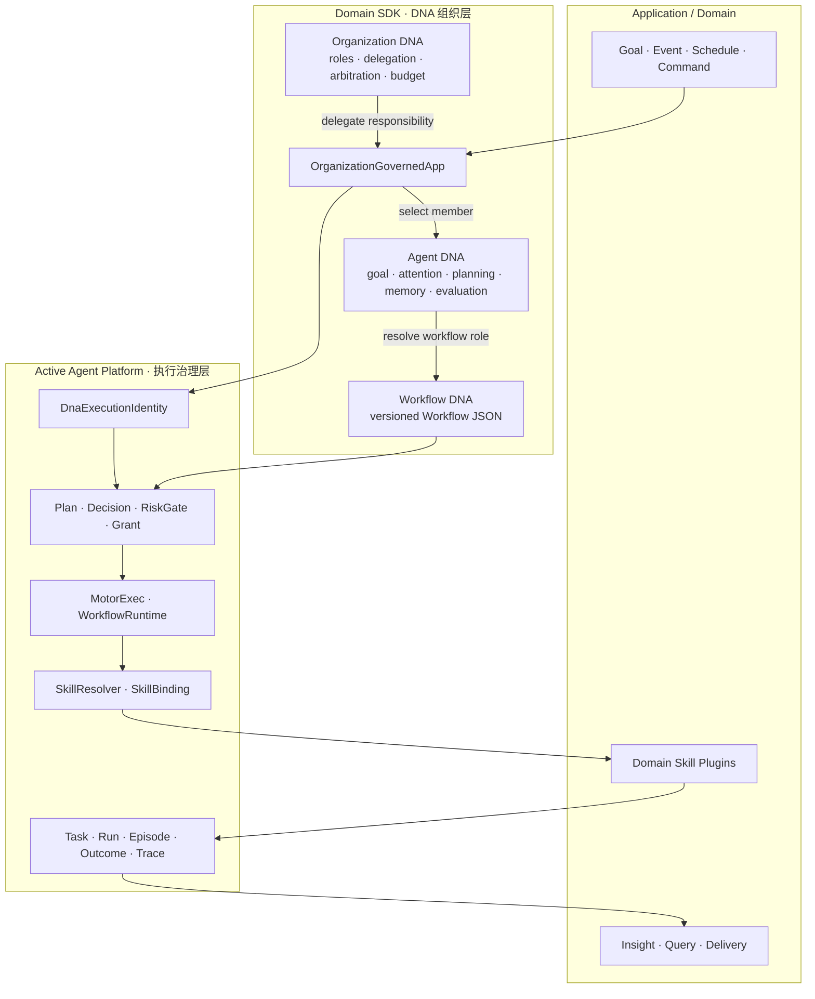
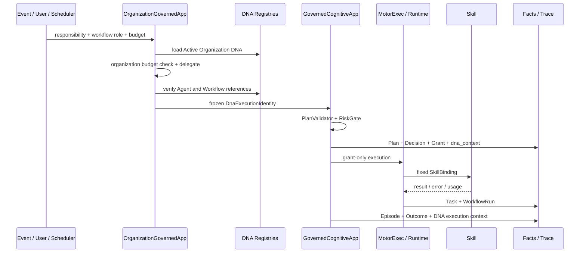
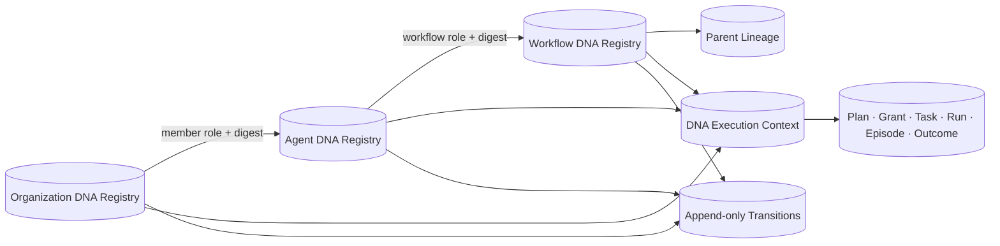
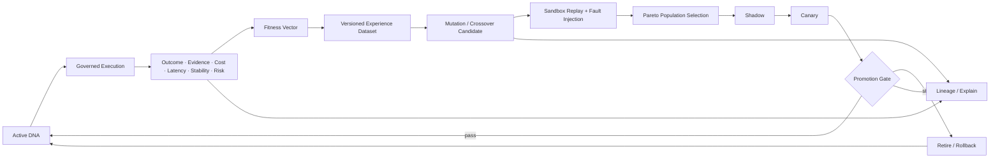

# DNA 技术架构

状态：Accepted  
版本：1.1  
日期：2026-08-19

DNA 是驱动 Agent 行为的版本化 JSON 编码，不是新的代码执行器。`WorkflowRuntime` 仍是唯一 Workflow 解释器，Skill 插件仍是实际能力实现；DNA 决定“由谁、依据什么认知策略、执行哪个 Workflow”，治理链决定“是否允许执行和晋级”。

## 1. 原则与边界

- Organization、Agent、Workflow 三层 DNA 使用独立身份；
- DNA 只包含声明式策略和强引用，不注入 Python 或新 Runtime 语义；
- Active 版本不可原地修改，内容变化必须产生新版本；
- 自动化只能产生 Candidate，不能绕过 Schema、RiskGate、Grant、权限和预算；
- 执行前重建三层引用，执行后可从 Outcome 追溯确切 DNA 版本；
- 演化采用多维评价、历史重放、群体选择和 Shadow/Canary，不以单一分数自动上线。

## 2. 总体逻辑架构

[](../assets/archify/bia-dna-evolution.architecture.html)

新总图把 DNA 拆成两个相互闭合但权限不同的环：执行环只读取并冻结 Active DNA，演化环只能生成和筛选 Candidate。二者通过 Outcome/Evidence 和 DNA Registry 连接，不允许训练数据直接修改正在执行或已 Active 的版本。完整阅读说明见 [BIA 架构视图地图](architecture-views.md)。

下面的结构图继续用于说明三层 DNA 与应用、SDK、治理执行组件之间的详细关系。



| 层 | 回答的问题 | 内容 | 不负责 |
|---|---|---|---|
| Organization DNA | 哪个 Agent 承担职责 | 成员、role、responsibility、委派、仲裁、预算、fallback | 节点执行 |
| Agent DNA | Agent 如何认知并选择能力 | Goal、Attention、Planning、Memory、Evaluation 及 Workflow role 引用 | 新权限、Skill 实现 |
| Workflow DNA | 一项能力如何编排 | Workflow JSON、节点、I/O、Capability、策略和谱系 | 常驻主循环、任意代码 |

## 3. 身份与双 digest

每个 DNA 版本包含 `dna_spec_version`、`dna_id`、`version`、`kind`、`status`、`content_digest` 和 `envelope_digest`。

- `content_digest` 覆盖影响行为的规范内容，用于执行固定、重放和归因；
- `envelope_digest` 覆盖内容及谱系、生成器等声明，用于治理审计；
- 状态晋级不改变 content；策略、成员、引用或 Workflow 内容变化必须改变 content；
- 引用统一使用 `dna_id/version/content_digest`，禁止只保存可漂移名称。

完整组织执行使用不可变身份：

```text
DnaExecutionIdentity
  organization: dna_id / version / content_digest
  organization_role
  agent:        dna_id / version / content_digest
  workflow:     dna_id / version / content_digest
```

入口从 SQLite Registry 重建 Organization member、Agent Workflow role 和 Workflow 文档，重算 digest，并要求三层均为 Active，不能仅信任调用方字符串。

## 4. 受治理执行链路



执行不变量：

1. Organization 预算是附加上限，不能替代 RiskGate；
2. 委派在 Plan 前冻结，同一 Grant 的重试不能重新路由；
3. unavailable role 隔离后才允许确定性 fallback；
4. Plan、PlanDecision、ExecutionGrant 保存同一 `dna_context`；
5. Task、Run、Episode、Outcome 通过追加式 `dna_execution_context` 关联；
6. Trace 返回相同 context，Fitness 和 Dataset 据此归因；
7. 旧领域调用保持兼容，新组织入口必须提供完整三层身份。

## 5. 持久化控制面



- Registry 使用 SQLite 事务和 CAS `revision`，唯一索引保证每个 DNA ID 最多一个 Active；
- Workflow DNA 经过 `CANDIDATE → VALIDATED → SHADOW → CANARY → ACTIVE`；
- 父谱系校验存在性、digest、数量、深度和无循环；
- transition、execution context、Fitness、Dataset、Replay、Selection、Promotion、Explain 是追加式事实；
- 重启后重算 digest，字段与文档内容不一致即拒绝加载或执行。

## 6. 演化闭环



| 阶段 | 输出 | 硬边界 |
|---|---|---|
| Fitness | 成功、证据、价值、成本、延迟、稳定性、风险向量 | 风险不能被平均收益抵消 |
| Experience Dataset | 固定版本、时间切分、可重放样本 | 防未来信息泄漏和错误归因 |
| Mutation/Crossover | Candidate DNA | 不改 Active、不扩大权限 |
| Sandbox Replay | Parent/Candidate 对照 | 不调用生产副作用 Skill |
| Population Selection | Pareto survivors | 硬拒绝优先于排名 |
| Shadow/Canary | Active 或回滚 | kill switch、样本量、观察窗、风险阈值 |
| Lineage/Explain | 可审计解释 | 不修改历史事实 |

训练数据增长不会直接改变 Active DNA。只有满足固定数据窗、最小样本、归因、重放改进、风险约束和晋级门，Candidate 才可能成为 Active。

## 7. Runtime、Skill、Loop 与记忆边界

- Workflow DNA 是现有 Workflow JSON 的版本化 Envelope，不创建第二套 Runtime；
- Agent/Organization DNA 只在执行前解析策略和引用；
- Skill 继续按 Capability Contract 解析为固定 SkillBinding，DNA 不能安装插件；
- Episode/Outcome 保存经历，DNA Registry 保存行为编码版本；
- DNA 演化不能覆盖历史事实或正在运行的 Task；
- LoopEngine 仍是唯一顶层调度层，Organization DNA 不是新事件循环或调度器。

不可自动变化：Kernel/Runtime 语义、Schema 主版本、权限及预算硬上限、真实交易禁令、NON_REPLAYABLE 规则、事务和恢复语义。

可以产生候选变化：Workflow 节点和受限参数、Skill Binding、DNA 组合、Agent 认知策略、Organization 成员和委派策略；所有变化必须成为新版本并重新治理。

## 8. 实现映射

| 架构组件 | 主要实现 |
|---|---|
| 三层定义与 Registry | `domain_sdk/dna.py`、`agent_dna.py`、`organization_dna.py` |
| 组织执行入口 | `domain_sdk/organization_execution.py` |
| 执行身份与校验 | `active_agent_platform/dna_execution.py` |
| Plan/Grant/Outcome 接入 | `active_agent_platform/governed_execution.py` |
| Trace | `active_agent_platform/trace.py` |
| SQLite 控制面 | `active_agent_platform/storage/migrations.py`，012～022 |
| 演化闭环 | `dna_fitness.py`、`experience_dataset.py`、`dna_candidates.py`、`dna_replay.py`、`dna_selection.py`、`dna_promotion.py`、`dna_explain.py` |
| 机器契约 | `schemas/dna/` 及 Plan/Decision/Grant 的 `dna_context` |

## 9. 关联文档

- [系统架构](system-architecture.md)
- [可进化 Workflow 与 Skill 架构](evolvable-workflow-skill-architecture.md)
- [平台与领域应用分层](platform-domain-separation.md)
- [安全与治理](safety-and-governance.md)
- [运行时数据与事务](../specifications/runtime-data-and-transactions.md)
- [DNA MVP 计划与实现状态](../delivery/dna-mvp-plan.md)
