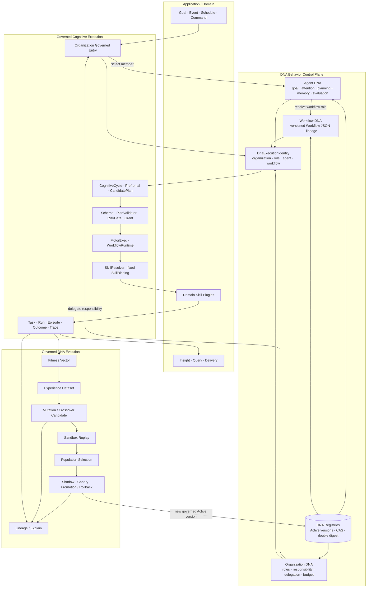

# 类脑主动式 AI Agent 系统架构

版本：v1.2  
日期：2026-08-19  
状态：Accepted  
适用场景：领域无关的主动式 Agent 平台；当前首个上层应用为量化研究

本文是 BIA 技术体系的总入口，集中说明领域无关的类脑底座、Loop 调度平台、应用插件边界和量化落地方式。精确协议以文末链接的专项规范为准。

## 1. 设计目标

### 1.1 要解决的问题

传统被动式 Agent 通常存在以下限制：

- 必须等待用户 Prompt 才执行；
- 没有持续环境感知；
- 单次任务结束后停止；
- 不维护稳定的目标、世界状态和历史经验；
- 工具调用、推理与安全授权混在一起；
- 失败后只返回错误，不形成可复用经验。

BIA 的目标是构建持续运行、受控自治的 Agent：

- 根据时间、市场变化、内部目标和外部命令主动工作；
- 依据当前世界快照、工作记忆和历史经验生成计划；
- 非交易时间不关机，进入复盘、整理和离线研究模式；
- 执行结果经过评价，再更新目标和记忆；
- Workflow JSON 与 Skill 可组合、可替换、可版本化进化；
- 关键输入、决策、授权、执行、评价和进化过程全部可审计。

### 1.2 核心设计原则

| 原则 | 说明 |
|---|---|
| 全局单引擎 | 一个应用级 LoopEngine 统管生命周期与全局调度，底层只使用一个 asyncio 事件循环 |
| 事件驱动主动性 | 主动行为来自事件、时间、目标和评价反馈，不靠无限调用 LLM |
| 脑区分治 | 感知、世界模型、注意、规划、执行、评价和记忆职责隔离 |
| 决策执行分离 | Prefrontal 只产生 CandidatePlan，不调用 Skill 或执行 Workflow |
| 概率认知受确定性控制 | LLM 提候选，Schema、Policy、RiskGate 和预算决定能否执行 |
| 常驻服务不等于 Workflow | 脑区是常驻服务；Workflow 是一次性 DAG，完成后释放 |
| 休息不等于关机 | 收盘后切换 REVIEW，执行复盘、记忆整理和离线研究 |
| 编排与能力解耦 | Workflow 节点声明 capability，Skill 提供可替换实现 |
| 不可变版本 | Active Workflow/Skill/Policy 不原地修改，改变产生新版本 |
| 结果闭环 | Task 成功不等于目标成功，必须经过 OutcomeEvaluator |
| 可恢复和可审计 | 事实先持久化，副作用幂等，崩溃可分类恢复，链路可追踪 |

## 2. 总体逻辑架构

### 2.1 总体能力说明

总体架构采用稳定能力分层，并以执行、DNA、事实三条主线贯穿。分层回答“能力属于哪里”，三条主线回答“目标如何执行、行为如何冻结、价值如何交付”。完整专题视图见 [BIA 架构视图地图](architecture-views.md)。

| 层 | 核心职责 | 典型组件 |
|---|---|---|
| 用户价值与交付 | 把结果变成可查询、可消费的信息 | CLI、Query API、MarketInsight、Notification、Report |
| 领域应用与接入 | 提供领域语义和能力实现 | Quant Agent、Domain SDK、Adapter、Domain Skill |
| Agent 组织与行为编码 | 声明由谁、按何种策略、执行哪个 Workflow | Organization DNA、Agent DNA、Workflow DNA、SkillBinding |
| 治理与执行平台 | 把概率候选变成受控、确定性执行 | Planner、RiskGate、Grant、MotorExec、Runtime、Recovery |
| 类脑内核 | 提供领域无关生命周期和认知端口 | LoopEngine、CognitiveCycle、State Machine、Memory、Clock |
| 事实、事件与可观测 | 保存真相、可靠传递并支持评价解释 | SQLite、Artifact、EventBus、Outbox、Outcome、Trace |

三条主线的完成条件分别是：执行必须 `grant-only`；DNA 必须以版本和 digest 冻结；用户交付必须可以追溯到 Plan、Task、Run、Evidence 和 Outcome。

### 2.2 原始 Markdown 总体逻辑架构（主参考）

下面保留原始 Markdown 文本图作为总体逻辑架构的主参考。它以最紧凑的方式表达 Quant Application、Domain SDK、Active Agent Platform 和 BrainAgent Kernel 的稳定分层，同时在平台内部明确展示 LoopEngine、DNA、Runtime、Skill、Outcome 和 Memory 主链路。

```text
┌────────────────────────────────────────────────────────────────────┐
│                 Quant Application · 量化应用                       │
│       Workflow · Policy · Market · Backtest · Factor · Report      │
└───────────────────────────────┬────────────────────────────────────┘
                                │ 公开扩展契约
┌───────────────────────────────▼────────────────────────────────────┐
│                  Domain SDK / Adapter · 领域接入                   │
│ Capability · Skill · Schema · DNA · Organization Entry · LoopProfile│
└───────────────────────────────┬────────────────────────────────────┘
                                │ 注册 / 装配
┌───────────────────────────────▼────────────────────────────────────┐
│               Active Agent Platform · 通用平台                    │
│                                                                    │
│   LoopEngine · 唯一调度层 / 一个 asyncio event loop               │
│   Scheduler · CorticalPolicy · CognitiveCycle · Budget · Recovery │
│                                │                                   │
│   Thalamus EventBus · Inbox · Outbox · Policy · Grant · Trace      │
│                                │                                   │
│   Sensory · Attention · Prefrontal · MotorExec · RestRepair        │
│                                │                                   │
│   Organization DNA → Agent DNA → Workflow DNA                     │
│              → Runtime → SkillResolver → SkillBinding → Skill      │
│                                │                                   │
│   TaskResult / Trace → OutcomeEvaluator → Memory                   │
└───────────────────────────────┬────────────────────────────────────┘
                                │ 实现通用类脑端口
┌───────────────────────────────▼────────────────────────────────────┐
│                  BrainAgent Kernel · 类脑底座                     │
│  Area Lifecycle · Message Port · State Machine · Memory · Clock    │
│  Perception · Attention · Planning · Execution · Evaluation        │
└────────────────────────────────────────────────────────────────────┘
```

### 2.3 六层与三条主线补充视图

六层 Archify 图保留为实验性补充材料，不作为本文主图。它用于横向检查用户价值、领域接入、DNA 编码、治理执行、类脑内核、事实可观测六类能力，以及执行、DNA、事实三条主线是否完整。

- [查看补充 SVG](../assets/archify/bia-logical-architecture.architecture.svg)
- [打开 Archify 交互版](../assets/archify/bia-logical-architecture.architecture.html)

### DNA 在总体架构中的位置

DNA 是 Domain SDK 与 Active Agent Platform 之间的版本化行为控制面：Organization DNA 决定职责委派，Agent DNA 决定认知策略和 Workflow role，Workflow DNA 提供可由现有 Runtime 解释的执行结构。三层身份在执行前冻结，执行结果再进入受治理演化闭环。



图中 DNA 不替代 Kernel、LoopEngine、WorkflowRuntime 或 Skill：它为这些稳定机制提供不可变、可追溯、可演化的行为编码。完整字段、状态机、持久化表和失败语义见 [DNA 技术架构](dna-architecture.md)。

### 平台内部运行链路

```text
事件 / 时间 / 命令
        ↓
CorticalSchedulingPolicy ── ADMIT / DEFER / REJECT
        ↓
CognitiveCycle ── World / Goal / Memory Snapshot
        ↓
Organization Delegate → Agent / Workflow DNA → DnaExecutionIdentity
        ↓
Prefrontal → CandidatePlan → Validator / RiskGate
        ↓
PlanDecision → SkillResolver → ExecutionGrant
        ↓
MotorExec → Workflow JSON → WorkflowRuntime → Skill
        ↓
TaskResult / Trace → OutcomeEvaluator → Memory
        ↓
Fitness → Dataset → Candidate → Replay → Selection → Shadow / Canary
        └────────── promotion / rollback feedback ──────────┘
```

### 平台内部组件图

当前图只表达分层，不表达平台内部组件的全部依赖。下面这张图专门描述领域无关平台的实现组成；箭头表示调用/事件/实现关系，不表示新增事件循环。

```text
                         ┌──────────────────────────┐
                         │     Composition Root      │
                         │ Kernel + Platform + App   │
                         │       依赖注入与装配       │
                         └────────────┬─────────────┘
                                      │
                         ┌────────────▼─────────────┐
                         │   Supervisor / Health     │
                         │ 启停 · 心跳 · 熔断 · SAFE  │
                         └────────────┬─────────────┘
                                      │ 管理
┌─────────────────────────────────────▼────────────────────────────────────┐
│                         LoopEngine（唯一调度层）                           │
│ Scheduler · CorticalPolicy · CognitiveCycle · Run Admission                │
│ Priority · Concurrency · Budget · Deadline · Cancellation · Recovery       │
└───────────────┬──────────────────────────┬─────────────────────────────────┘
                │                          │
                ▼                          ▼
┌──────────────────────────┐   ┌───────────────────────────────────────────┐
│ Thalamus EventBus         │   │ DNA Registry / Policy / Grant              │
│ Inbox · Outbox · DLQ      │   │ Organization · Agent · Workflow DNA        │
│ transient delivery       │   │ RiskGate · Grant · Identity / Digest        │
└──────────────┬───────────┘   └──────────────────────┬────────────────────┘
               │                                      │
               ▼                                      ▼
┌──────────────────────────┐   ┌───────────────────────────────────────────┐
│ Brain Areas               │   │ WorkflowRuntime                            │
│ Sensory · WorldModel     │   │ JSON DAG · Reference · Control Nodes       │
│ Attention · Prefrontal  │   │ Timeout · Retry · Cancel · Sub-workflow     │
│ WorkingMemory · Rest     │   └──────────────────────┬────────────────────┘
└──────────────┬───────────┘                          │
               │                                      ▼
               │                         ┌──────────────────────────────┐
               └────────────────────────►│ SkillResolver → SkillBinding │
                                         │ SkillAdapter → Skill          │
                                         └──────────────┬───────────────┘
                                                        │
                         ┌──────────────────────────────▼────────────────┐
                         │ OutcomeEvaluator · Trace · ArtifactStore       │
                         │ DNA Fitness · Dataset · Evolution Pipeline     │
                         └──────────────────────────────┬────────────────┘
                                                        │
                         ┌──────────────────────────────▼────────────────┐
                         │ SQLite Facts / Repository                       │
                         │ Plan · Grant · Task · Episode · DNA Context     │
                         │ Fitness · Replay · Promotion · Lineage          │
                         │ EventBus 不是事实数据库                         │
                         └────────────────────────────────────────────────┘
```

BrainAgent Kernel 位于平台实现之下，提供 Area Lifecycle、Message Port、State Machine、Memory Port 和 Clock 等抽象端口；平台实现这些端口，领域应用只能通过 Domain SDK 接入。

### 认知执行链路图

这张图描述一次从刺激到结果的完整认知周期。每个周期拥有固定的 World、Goal 和 Memory Snapshot；新的刺激不会修改正在运行的周期。

```text
┌────────────────────┐
│ Stimulus            │ 事件 / 时间 / 外部命令 / 任务反馈
└─────────┬──────────┘
          ▼
┌────────────────────┐
│ Sensory + Scheduler │ 采集、归一化、窗口和过期
└─────────┬──────────┘
          ▼
┌────────────────────────────┐
│ CorticalSchedulingPolicy    │ ADMIT / DEFER / REJECT
│ priority · salience · aging │ 不做业务推理，不调用 LLM
└─────────┬──────────────────┘
          ▼
┌────────────────────────────┐
│ Attention + CognitiveCycle  │ 合并刺激，分配 cycle_id
│ WorldSnapshot               │ 固定 World / Goal / Memory Snapshot
└─────────┬──────────────────┘
          ▼
┌────────────────────┐
│ DNA Governed Entry  │ Organization 委派，固定 Agent/Workflow 身份
└─────────┬──────────┘
          ▼
┌────────────────────┐
│ Prefrontal          │ 生成 CandidatePlan（只读，不执行）
└─────────┬──────────┘
          ▼
┌────────────────────────────┐
│ PlanValidator + RiskGate    │ Schema · DNA Registry · Policy · Budget
└─────────┬──────────────────┘
          ▼
┌────────────────────────────┐
│ PlanDecision + SkillResolver│ 决策事实 + 固定 SkillBinding
│ GrantIssuer                 │ 签发 ExecutionGrant
└─────────┬──────────────────┘
          ▼
┌────────────────────────────┐
│ MotorExec                   │ 校验 Grant，创建一个逻辑 Task
│ WorkflowRuntime             │ 执行 Workflow JSON DAG
└─────────┬──────────────────┘
          ▼
┌────────────────────┐
│ Skill / Artifact    │ 动态能力调用、结果、错误、资源用量
└─────────┬──────────┘
          ▼
┌────────────────────────────┐
│ TaskResult / Trace           │ SQLite Facts + Outbox + DNA Context
└─────────┬──────────────────┘
          ▼
┌────────────────────────────┐
│ OutcomeEvaluator             │ execution · goal · quality · evidence
└─────────┬──────────────────┘
          ▼
┌────────────────────────────┐
│ Episodic / Procedural Memory │ Goal 更新、经验候选、EvolutionProposal
└─────────┬──────────────────┘
          ▼
┌────────────────────────────┐
│ DNA Evolution Pipeline      │ Fitness · Dataset · Replay · Selection
│                             │ Shadow · Canary · Promotion · Rollback
└────────────────────────────┘
```

失败路径不绕过上述边界：Schema/Policy 失败生成拒绝事实；Skill 失败按恢复类型处理；NON_REPLAYABLE 进入 `REQUIRES_REVIEW`；事实和 Outbox 在同一事务中提交，重启后由 LoopEngine 恢复。

图示约束：Quant Application 只能通过 SDK/Adapter 接入；平台核心不依赖量化；Kernel 不依赖平台和应用；所有长期领域 Loop（例如 FactorDiscoveryLoop）都必须通过 LoopEngine 请求一次性 Workflow Run。

外部行情、时间、CLI/WebUI 和运维命令先经过 Sensory、Scheduler 或 Command Adapter，再作为消息进入丘脑总线。`BrainAgent Kernel + Active Agent Platform` 是类脑运行底座；`LoopEngine` 是平台内唯一调度层；它们都不等同于 Python 的 asyncio loop，后者只是承载协程和异步 I/O 的运行机制。Workflow Run 是运动执行脑区内部创建的有限生命周期 DAG Task；周期触发由 LoopEngine/Scheduler 创建新实例，Workflow JSON 本身不得包含永久主循环。

### 2.1 三层产品化模型

```text
Quant Application（当前应用）
  ├─ 量化 Workflow、Policy、Schema、报告
  └─ market/backtest/factor 等领域 Capability 与 Skill
                 ▲ 使用扩展点
Active Agent Platform（领域无关平台）
  ├─ LoopEngine / WorkflowRuntime / EventBus
  ├─ Skill Registry/Resolver / Capability Contract
  ├─ Workflow DNA Registry / Execution Identity
  └─ Policy / Grant / Memory / Trace / Artifact / Outcome / Evolution
                 ▲ 由平台承载
BrainAgent Kernel（类脑底座）
  ├─ 脑区生命周期与消息端口
  ├─ 感知、注意、规划、执行、评价通用协议
  └─ Working/Episodic/Procedural Memory 抽象
```

Kernel 回答“如何提供可复用的类脑运行协议”；Platform 回答“如何可靠调度 Loop、Workflow、Skill 和记忆”；Application 回答“领域目标、数据、策略和结果是什么”。量化代码不得进入 Kernel/Platform，底层也不得依赖行情、交易日历、回测库、因子或具体供应商。

### 2.2 分层依赖规则

```text
BrainAgent Kernel
  ← Active Agent Platform
    ← Domain Adapter
      ← Quant Application
```

- 依赖只能向下，底层不得反向 import 上层领域包；
- Kernel 只定义协议、状态机、端口和生命周期；
- Platform 实现 JSON Workflow、Skill Binding、可靠事件、授权、观测和恢复；
- Domain Adapter 把领域时钟、数据、算法和外部系统注册为 Capability/Skill；
- Quant Application 只装配领域 Workflow、Policy、Schema、数据源和报告；
- 换成客服、运维、研究或办公自动化时，只替换 Domain Adapter 与 Application。

### 2.3 Loop 的层次

LoopEngine 之下可以托管多个持久化 Loop Profile，但它们不是独立事件循环：

| Loop 层 | 示例 | 作用 |
|---|---|---|
| 系统 Loop | `LoopEngine` | 唯一全局调度节律 |
| 认知 Loop | `CognitiveCycle` | 一次刺激到计划/授权的有限周期 |
| 领域 Loop | `FactorDiscoveryLoop`、`DailyReviewLoop` | 按领域保存迭代状态、checkpoint 和终止条件 |
| 执行 Loop | `WorkflowRun` | 一次 JSON DAG 执行，完成后销毁 |

只有系统 Loop 拥有顶层生命周期控制权；领域 Loop 只能向上请求下一轮 Workflow Run。

### 2.4 LoopEngine 的所有权

`LoopEngine` 是系统唯一调度层，负责：

- 启停和监督常驻脑区服务；
- 接纳事件、时间、目标和人工命令刺激；
- 调度认知周期与获批 Workflow Run；
- 执行全局优先级、并发、期限、费用和资源预算；
- 协调取消、恢复、降级和优雅关闭；
- 将所有协程挂载到唯一底层 asyncio 事件循环。

它不解释 Workflow 节点、不解析 Skill 绑定，也不做业务推理。节点调度属于 WorkflowRuntime，Skill 解析属于 SkillResolver，业务计划属于 Prefrontal。

### 2.5 调度所有权

| 组件 | 只负责调度 |
|---|---|
| LoopEngine | 常驻服务、系统事件、认知周期和全局 Workflow Run 配额 |
| Scheduler | 可靠时间触发、窗口、冷却和过期 |
| CognitiveCoordinator | 哪些刺激进入同一次认知周期 |
| MotorExec | 已获批 Workflow Run 的优先级、并发、取消和恢复 |
| WorkflowRuntime | 单次 Workflow JSON DAG 内部节点 |
| asyncio | 协程和异步 I/O 执行，不包含业务调度策略 |

### 2.6 皮层调度策略 CorticalSchedulingPolicy

类脑系统需要类似“大脑皮层资源分配”的能力，但不增加新的常驻脑区或第二个调度器。工程上将其定义为 LoopEngine 内部可替换策略：它只回答“下一刻允许哪些刺激进入认知周期、哪些获批 Run 获得资源”。

```text
LoopEngine
  ├─ Stimulus Admission Queue
  ├─ CorticalSchedulingPolicy
  │    ├─ rank_stimuli()
  │    └─ rank_runs()
  ├─ CognitiveCycle Manager
  ├─ WorkflowRun Admission
  └─ Budget / Recovery Controller
```

默认 MVP 使用确定性 `DeterministicCorticalPolicy`，评分只依赖可审计事实：

```text
score = base_priority + salience + goal_urgency + deadline_urgency
      + recovery_bonus + aging_bonus - estimated_cost
      - conflict_penalty - dependency_penalty
```

每次决策必须输出 `ADMIT/DEFER/REJECT`、score、命中的 rule ID、原因、预算快照和下一评估时间，禁止只返回不可解释的分数。

| 组件 | 决定什么 | 不决定什么 |
|---|---|---|
| Attention | 单个事件是否显著及其证据 | 不分配全局运行资源 |
| CorticalSchedulingPolicy | 刺激和 Run 的全局准入、排序、公平性 | 不做业务推理、不生成 Plan |
| CognitiveCoordinator | 哪些已准入刺激合并为同一认知周期 | 不控制 Workflow 并发 |
| Prefrontal | 生成 CandidatePlan | 不执行、不分配协程 |
| MotorExec | 获批 Run 的执行队列、取消和恢复 | 不重新判断认知显著性 |
| WorkflowRuntime | 单个 JSON DAG 的节点调度 | 不参与全局任务排序 |

策略必须实现优先级 aging，防止后台任务永久饥饿；实时行情、人工安全命令和崩溃恢复可获得加权，但仍受 Policy/RiskGate。交易时段因子发现 Loop 默认降权，REVIEW/HOLIDAY 时提高后台预算；SAFE 模式只准入诊断、恢复和明确白名单任务。

v1.5 可以根据 Outcome 调整权重候选，但 Active Policy 不原地修改，LLM 不直接给出最终调度决定。

## 3. 分层职责

| 层级 | 核心组件 | 职责 |
|---|---|---|
| 底座层 | BrainAgent Engine、Supervisor | 脑区装配、依赖、治理、记忆和能力运行环境 |
| 调度层 | LoopEngine、asyncio loop | 应用级全局调度、唯一运行机制、异常隔离、优雅关闭 |
| 入口层 | Sensory、Scheduler、Command Adapter | 采集环境、产生时间刺激、接收受控命令 |
| 通信层 | EventBus、Inbox、Outbox | 发布订阅、背压、消费幂等、事实事件重投 |
| 世界状态层 | StateController、WorldModel | 确定系统状态，维护当前事实与不可变快照 |
| 认知层 | Attention、GoalPolicy、CognitiveCoordinator | 过滤刺激、选择焦点、形成一次认知周期 |
| 决策层 | Prefrontal、PlanValidator、RiskGate | 候选规划、格式校验、权限预算和风险控制 |
| 执行层 | MotorExec、WorkflowRuntime | 调度获批 Workflow、状态、超时、取消和恢复 |
| 能力层 | Capability Registry、SkillResolver、Skill | 能力契约、确定性绑定及具体能力实现 |
| 评价层 | OutcomeEvaluator | 判断执行成功、目标完成和决策质量 |
| 记忆层 | Working/Episodic/Semantic Memory | 即时上下文、历史经历、经验证知识 |
| 修复进化层 | RestRepair、Evolution Pipeline | 复盘、压缩、候选改进、验证、晋级和回滚 |
| DNA 治理层 | Organization/Agent/Workflow DNA、Registry、Execution Identity | 三层行为编码、确定性委派、版本引用、执行归因和演化治理 |
| 治理运维层 | Policy、Observability、CLI | 安全策略、日志指标、诊断和人工控制 |
| 产品交互层 | Quant CLI、Insight Query Service、Delivery Adapter | 将 Outcome/Trace 投影为用户洞察，提供只读查询、解释和受控通知；不进入 Kernel/Platform |

产品交互层是最外层应用能力：平台只保证结果可靠产生、保存、查询和投递，`apps.quant_agent` 定义 MarketInsight、报告文案、订阅偏好与渠道。CLI/API 的命令面与查询面严格分离：命令经 Command Adapter 进入治理链，查询读取版本化 Read Model；任何查询不得直接调用 Skill 或修改执行事实。MVP 只交付本地 CLI 与 JSON/Markdown，保留 HTTP API 应用服务边界但不开放网络服务。

## 4. 脑区与工程组件

### 4.1 感知脑区 Sensory

类比视觉、听觉等感觉皮层。

职责：

- 采集行情、数据源健康和外部事件；
- 将供应商格式归一化为感知事件；
- 保留来源、event time、source sequence 和数据质量；
- 只采集和标准化，不判断应该执行什么任务。

默认感知策略：

| 运行状态 | 默认间隔 | 行为 |
|---|---:|---|
| NORMAL + TRADING | 15 秒 | 高频市场感知 |
| NORMAL + IDLE | 40 秒 | 降频等待刺激 |
| REVIEW + CLOSED | 300 秒 | 健康与低频状态感知 |

时间触发属于 Scheduler，而不是依赖 Sensory 猜测时间窗口。

### 4.2 世界模型 WorldModel

类比大脑对“现在发生了什么”的当前信念。

职责：

- 汇总市场、时间、健康、任务和数据质量事实；
- 处理乱序、重复、修订、冲突和过期；
- 为每个事实保留来源、置信度和新鲜度；
- 生成不可变、可复现的 WorldSnapshot；
- 不承担长期历史存储和开放式规划。

### 4.3 注意脑区 Attention

职责：

- 对高频事件去重、合并和限流；
- 使用确定性规则计算显著性；
- 输出 rule ID、score、基线、当前值和证据消息；
- 抑制无变化事件触发不必要的 LLM 调用。

学习型 Attention 放在 v1.5，MVP 使用可解释规则。

### 4.4 目标与认知协调

GoalPolicy 保存固定系统目标、完成条件、期限、预算和冲突域。CognitiveCoordinator：

- 合并同一短窗口内的刺激；
- 固定 WorldSnapshot、GoalSnapshot 和 MemoryContext；
- 分配 cognitive cycle ID；
- 抑制重复或互相冲突的计划；
- 控制同时规划数量。

它不是第二个大循环，而是由 LoopEngine 调度的一次事件触发认知事务。

### 4.5 前额叶 Prefrontal

类比推理、规划和抑制无效行为的前额叶皮层。

输入：

- 本轮焦点和触发事件；
- 不可变 WorldSnapshot；
- 固定目标及预算；
- 有界 WorkingMemory；
- 带来源的相似历史案例。

输出：符合 Plan Schema 的 CandidatePlan，包括 Workflow ID/版本、参数、优先级、期限、证据和理由。

约束：

- 只选择 Active Registry 中的 Workflow；
- 不调用 Skill，不运行 Workflow；
- 不修改 WorldModel、GoalPolicy、Risk Policy 或 Registry；
- LLM 异常时走确定性降级或明确拒绝。

### 4.6 工作记忆 WorkingMemory

职责：

- 保存本轮认知焦点、快照引用和短期中间上下文；
- 保存当前运行任务的轻量状态引用；
- 按容量、TTL 和重要度淘汰；
- 重启后丢失或由持久事实重建。

完整执行状态属于 Task/Trace，不把大对象重复放入 WorkingMemory。

### 4.7 运动执行脑区 MotorExec

职责：

- 只消费 ExecutionGrant；
- 控制任务优先级、并发、deadline、取消和有限重试；
- 调用 WorkflowRuntime；
- 发布 TaskTransition、TaskResult 或结构化 Error；
- 按 Skill 副作用类型恢复崩溃任务。

执行层不能擅自生成新任务、换 Workflow 或扩大能力权限。

### 4.8 结果评价 OutcomeEvaluator

评价三个不同问题：

1. Workflow 是否成功执行；
2. 目标是否真正完成；
3. 该决策相对成本、风险和基线是否有质量。

即时结果使用规则评价；需要等待市场结果的任务登记延迟评价窗口。评价结果才可以推进 Goal、调整候选经验置信度或产生 EvolutionProposal。

### 4.9 休眠修复 RestRepair

进入 REVIEW 后：

- 停止实时行情扫描；
- 执行当日 Episode 和错误复盘；
- 压缩、归档和清理记忆；
- 运行历史回测、数据同步和备份；
- 后续可调用 Qlib/RD-Agent 执行离线研究；
- 生成候选经验和 Workflow 改进提议，不直接修改 Active 版本。

## 5. 丘脑事件总线

### 5.1 通信规则

- 脑区间业务协作通过事件；
- WorldModel、Memory、Clock 等有界读取通过依赖注入查询端口；
- 每个订阅者有独立有界队列；
- 高频感知事件可合并，业务事实事件经 Outbox；
- 消费者使用 Inbox/processed-message 幂等；
- EventBus 不作为事实数据库。

### 5.2 核心消息

| 消息 | 发布者 | 主要订阅者 | 说明 |
|---|---|---|---|
| `perception.snapshot` | Sensory | WorldModel、Attention | 原始或归一化观测 |
| `command.received` | CLI/API | Attention、Coordinator | 外部受控刺激 |
| `schedule.triggered` | Scheduler | Coordinator、RestRepair | 时间窗口触发 |
| `brain.state_changed` | StateController | 全部相关脑区 | 三维状态变化 |
| `world.snapshot_created` | WorldModel | Coordinator、Memory | 可复现世界快照 |
| `attention.salient_event` | Attention | Coordinator、WorkingMemory | 显著刺激及证据 |
| `goal.changed` | GoalPolicy/Evaluator | Coordinator、Memory | 目标状态变化 |
| `plan.candidate_created` | Prefrontal | PlanValidator | 未授权候选计划 |
| `plan.decided` | Validator/RiskGate | MotorExec、Memory | 批准或拒绝事实 |
| `execution.granted` | RiskGate/Resolver | MotorExec | 固定 Workflow/Skill 绑定 |
| `task.started/finished/failed` | MotorExec | Evaluator、Memory、Prefrontal | 执行反馈 |
| `outcome.evaluated` | OutcomeEvaluator | GoalPolicy、Memory、Evolution | 结果与质量评价 |
| `memory.consolidated` | RestRepair/Memory | Prefrontal | 记忆巩固完成 |
| `evolution.proposed` | Designer/Miner | Evolution Validator | Workflow 改进候选 |

完整信封、背压和兼容规则见[事件协议](../specifications/event-protocol.md)。

## 6. 大脑状态模型

原始 ACTIVE/IDLE/SLEEP_REVIEW 三态混合了市场阶段、任务负载和健康状态。实现采用三个正交维度：

```text
market_phase = PRE_OPEN | AUCTION | TRADING | CLOSED | HOLIDAY
workload     = IDLE | BUSY
brain_mode   = BOOTING | NORMAL | REVIEW | DEGRADED | SAFE | SHUTTING_DOWN
```

与产品概念的映射：

| 产品状态 | 工程状态组合 | 行为 |
|---|---|---|
| ACTIVE | NORMAL + PRE_OPEN/AUCTION/TRADING + BUSY/IDLE | 实时感知和任务优先 |
| IDLE | NORMAL + 任意有效市场阶段 + IDLE | 降频、等待刺激 |
| SLEEP_REVIEW | REVIEW + CLOSED/HOLIDAY | 复盘、整理和离线研究 |

状态由 StateController 根据 Clock、TradingCalendar 和健康事实确定，Prefrontal 不负责决定系统状态。外部命令只能触发允许动作，不得伪造市场阶段。

## 7. Workflow 与脑区

| 维度 | 脑区服务 | Workflow JSON |
|---|---|---|
| 生命周期 | 随进程常驻或按服务生命周期运行 | 一次性，执行完释放 |
| 角色 | 工人、协调者和治理者 | 版本化作业指导书 |
| 数量 | 少量固定逻辑模块 | 按业务持续增加 |
| 通信 | EventBus + 受控查询端口 | 节点引用和 DAG 数据传递 |
| 嵌套 | 脑区不可嵌套 | 支持受限 sub-workflow |
| 进化 | 代码和策略需工程发布 | JSON 候选可自动提出与验证 |

核心结论：脑区不能被做成永久 Workflow；Workflow Run 只能作为唯一事件循环上的有限 Task。

## 8. Workflow、节点和 Skill

### 8.1 解耦关系

```text
WorkflowSpec
  → NodeSpec(capability)
  → SkillResolver
  → BindingSpec(pinned skill/version/digest)
  → Skill invoke
```

节点不直接依赖 easy-tdx、Qlib 或 RD-Agent 的函数名，而声明 `market.auction.read@1`、`research.backtest.run@1` 等能力契约。不同环境可绑定不同 Skill。

### 8.2 节点类型

| 类型 | 说明 |
|---|---|
| `skill` | 通过 capability contract 调用可替换 Skill |
| `sub_workflow` | 调用固定 ID/版本的子 Workflow |
| `condition` | 使用受限表达式选择分支 |
| `parallel` | 受并发和失败策略约束的并行分支 |
| `delay` | 最长 60 秒的异步等待，更长等待交给 Scheduler |

正式 1.0 只有两类节点：控制节点 `condition/parallel/delay/sub_workflow` 与能力节点 `skill`。LLM、行情、数据库、通知、Qlib 和 RD-Agent 都通过 Capability Contract 接入 Skill，不保留 `tool` 或 `llm_reason` 双轨执行语义。

引用使用受限 JSONPath 子集，例如 `$.params.trade_date`、`$.nodes.fetch.output`。禁止 `eval`、任意 Python/Shell 和动态模块导入。

### 8.3 子 Workflow

- 默认最大嵌套深度 8；
- 发布前检测直接和间接递归；
- 子 Workflow 参数、输出和版本独立；
- 父流程固定子流程版本；
- 总节点、总时限和并发预算跨嵌套累计。

## 9. Workflow 双向进化

```text
自上而下：Goal + WorldSnapshot
  → WorkflowDesigner
  → WorkflowCandidate / WorkflowPatch

自下而上：Trace + OutcomeEvaluation + cost/failure metrics
  → ProposalMiner
  → WorkflowPatch / BindingPolicyPatch
```

生命周期：

```text
DRAFT → VALIDATED → REPLAYED → SHADOW → CANARY
      → ACTIVE → DEPRECATED / ROLLED_BACK
```

约束：

- Active JSON 不原地修改；
- 每次修改产生版本、digest、父版本和 Patch；
- 运行中任务固定 Workflow 与 Skill 版本；
- 自动提议不能扩大权限或安装新 Skill；
- 安全、权限、审计和数据质量是硬约束；
- MVP 只实现候选和静态验证，自动 Canary 放到 v1.5；
- 真实交易能力永远不能通过自动进化自行授权。

## 10. 量化 Workflow 清单

| Workflow ID | 名称 | 触发时机 | 主要能力 |
|---|---|---|---|
| `auction_monitor` | 集合竞价监控 | 交易日 09:25 | 竞价读取、轮动扫描、信号评价 |
| `sector_rotation_scan` | 板块轮动扫描 | 盘中定时/显著事件 | 板块行情、RPS、季节因子 |
| `rps_calculation` | RPS 相对强弱 | 子 Workflow | RPS 计算 |
| `season_factor_analysis` | 季节因子分析 | 子 Workflow | 历史统计和季节权重 |
| `market_summary` | 市场摘要 | 显著变化/外部命令 | 世界快照、结构化摘要 |
| `signal_alert` | 信号告警 | 条件触发 | 本地通知/Webhook |
| `data_sync` | 行情同步 | 收盘后 | 数据拉取、校验、落库 |
| `daily_review` | 每日复盘 | CLOSED/REVIEW | Episode 聚合、评价、候选经验 |
| `memory_compress` | 记忆压缩 | REVIEW | 聚类、摘要、归档 |
| `daily_backtest_review` | 每日回测 | 收盘后 | Qlib 查询和回测 |
| `rd_agent_factor_dig` | 因子研究 | 夜间/休市 | RD-Agent 离线任务 |

MVP 首先实现 `market_summary` 和 `daily_review`，其余按路线图接入。

## 11. Capability 与 Skill 清单

| Capability | 候选 Skill | 阶段 |
|---|---|---|
| `market.daily.read@1` | easy-tdx daily / FakeMarket | 量化适配 |
| `market.auction.read@1` | easy-tdx auction / FakeMarket | 量化适配 |
| `market.sector.read@1` | easy-tdx sector | 量化适配 |
| `analysis.rps.calculate@1` | 内置 RPS Skill | v1 |
| `analysis.season.calculate@1` | 内置季节因子 Skill | v1 |
| `research.qlib.query@1` | Qlib Query Skill | v1.5 |
| `research.backtest.run@1` | Qlib Backtest Skill | v1.5 |
| `research.factor.mine@1` | RD-Agent Skill | v1.5/v2 |
| `reason.structured@1` | GPT/Claude/本地模型 Adapter | MVP 后半 |
| `notification.send@1` | Local Sink / Webhook | MVP/P1 |
| `memory.search@1` | SQLite FTS / Vector Search | MVP/v1.5 |

数据库不是由 Workflow 任意调用 `db_write`；结构化持久化应优先经过领域 Repository，避免 Workflow 绕过事务和审计约束。

## 12. 09:25 竞价与板块轮动完整示例

1. 09:15，Scheduler 根据 TradingCalendar 产生盘前触发，StateController 设置 `NORMAL/PRE_OPEN`。
2. Sensory 开始高频感知，WorldModel 更新市场事实和数据质量。
3. 09:25:05，新竞价观测达到确定性显著阈值，Attention 发布带证据的 salient event。
4. CognitiveCoordinator 合并同窗口刺激，固定 WorldSnapshot、GoalSnapshot 和 MemoryContext。
5. Prefrontal 选择 `auction_monitor@1.0.0`，生成 CandidatePlan。
6. PlanValidator 校验 Schema、Workflow Registry、参数、DAG 和过期时间。
7. RiskGate 校验能力、数据新鲜度、预算、当前模式和冷却期，产生 PlanDecision。
8. SkillResolver 将能力固定绑定到本次可用的 Skill 版本，产生 ExecutionGrant。
9. MotorExec 创建 Task，WorkflowRuntime 执行：
   - 读取竞价数据；
   - 调用 `sector_rotation_scan`；
   - 拉取板块数据并计算 RPS；
   - 计算季节因子；
   - LLM 生成符合 Schema 的结构化轮动判断；
   - 条件满足时写入幂等通知。
10. 每个节点保存输入摘要、输出引用、版本、时延、费用和错误。
11. MotorExec 发布 TaskResult；OutcomeEvaluator 区分执行成功、信号产出和后续信号质量。
12. Episode 写入中期记忆；延迟质量评价登记未来观察窗口。
13. 收盘进入 REVIEW，daily_review 汇总当日结果，并产生候选经验或 WorkflowPatch。
14. Loop 始终运行，等待下一刺激，不需要用户逐条 Prompt。

## 13. 记忆体系

| 类型 | 用途 | MVP 存储 |
|---|---|---|
| Working Memory | 当前认知周期和轻量任务上下文 | 有界内存 |
| WorldModel | 当前可信世界事实 | 内存投影 + checkpoint |
| Episodic Memory | 观测—计划—执行—评价经历 | SQLite |
| Semantic Memory | 经验证结论、失败经验和案例 | SQLite，后续向量库 |
| Procedural Memory | Workflow、Skill 绑定和演进 lineage | Registry + SQLite |
| Policy Memory | 权限、风险、预算和禁止事项 | 只读版本化配置 |

原始 Trace 不等于长期知识。只有带证据、评价、适用范围、置信度和有效期的候选经验，经过验证后才能成为 Semantic Memory。

## 14. 技术选型

| 组件 | MVP | 演进 |
|---|---|---|
| 语言 | Python 3.11+ | 保持 |
| 控制事件循环 | asyncio | 保持单一控制内核 |
| 事件总线 | 进程内有界 Queue | Redis Streams/NATS（达到触发条件后） |
| 事实存储 | SQLite | PostgreSQL（多实例/写瓶颈后） |
| 长期检索 | SQLite FTS/结构化检索 | pgvector/Chroma/Milvus，评估后选择 |
| Workflow | JSON Schema + DAG Runtime | Replay/Shadow/Canary |
| Skill | Python Adapter + Manifest | 隔离 Worker/容器 |
| LLM | 统一 Adapter + Fake | GPT/Claude/本地模型路由 |
| 行情 | JSONL Fake | easy-tdx 等 Skill |
| 回测 | Fake | Qlib Skill |
| 因子研究 | 不进入 MVP | RD-Agent Skill |
| 文档 | Markdown + 在线浏览器 | CI 构建静态站点 |

## 15. 非阻塞与资源隔离

禁止在控制事件循环中使用 `time.sleep()`、阻塞网络调用或 CPU 密集计算：

```python
async def sensory_tick() -> None:
    observation = await market_skill.read_snapshot()
    await event_bus.publish(observation)
    await asyncio.sleep(interval_seconds)
```

- 异步网络 I/O 直接 await；
- 无异步接口的阻塞 SDK 使用受限 `asyncio.to_thread()`；
- CPU 密集回测和因子计算使用 ProcessPool 或外部 Worker；
- 长任务仍由主 Loop 异步提交、取消、监听和记录；
- 所有线程池、进程池和 Skill 都有并发、超时和资源预算。

## 16. 强制技术约束

1. 全局只创建一个 asyncio 控制事件循环。
2. Workflow 不得定义永久循环。
3. Prefrontal 不调用 Skill，不执行 Workflow。
4. 只有 ExecutionGrant 可以进入 MotorExec。
5. 一个认知周期只使用一组不可变快照。
6. EventBus 不作为事实存储，事实事件使用 Outbox/Inbox。
7. Active Workflow/Skill/Policy 不原地修改。
8. Skill 绑定必须固定版本和 digest，并写入 Trace。
9. 子 Workflow 最大深度、节点数、输出和总时限受限。
10. 所有副作用声明恢复类型和幂等键。
11. WorkingMemory、上下文、队列和大输出均有容量上限。
12. 所有模型输出经过结构化 Schema、白名单和风险校验。
13. Task 成功不自动等于 Goal 成功。
14. 未经评价和验证的经验不能修改生产策略。
15. 密钥不得进入消息、Prompt、Trace 或 Workflow JSON。

## 17. 演进路线

### MVP 0.1

- 单 Loop、Supervisor、EventBus、Inbox/Outbox；
- Scheduler、StateController、WorldModel；
- 规则 Attention、固定 GoalPolicy、CognitiveCoordinator；
- Workflow Runtime、Capability Registry、Fake Skill；
- CandidatePlan、RiskGate、ExecutionGrant；
- OutcomeEvaluator、SQLite Episode、夜间复盘；
- 市场摘要与每日复盘两个完整闭环。

### v1.5

- easy-tdx、Qlib 和可选 RD-Agent Skill；
- WorkflowPatch、历史回放、影子运行和低风险 Canary；
- 向量检索评估；
- 延迟结果评价和策略质量基线；
- 更精细的目标管理和失败学习。

### v2.0

- 多模型路由，不按脑区盲目堆模型；
- 学习型 Attention 和预测误差驱动感知；
- 经过审批的自我反思和低风险自动晋级；
- 按负载隔离外部 Worker；
- 在真实需求出现后评估多实例和分布式总线。

## 18. 风险与控制

| 风险 | 主要控制 |
|---|---|
| LLM 决策不稳定 | 结构化输出、白名单、Validator、RiskGate、确定性降级 |
| 消息风暴 | 有界队列、合并、背压、Attention、优先级 aging |
| 记忆膨胀 | 分层、TTL、摘要、保留期、证据和有效期 |
| Workflow 递归/死锁 | DAG、深度限制、deadline、取消、并发上限 |
| Skill 不兼容 | capability 主版本、I/O Schema、契约测试、固定 digest |
| 自动进化失控 | 候选隔离、回放、Shadow、Canary、硬策略、回滚 |
| 行情限流和陈旧 | Skill 限流、缓存、新鲜度校验、熔断 |
| 回测过拟合 | 样本外验证、成本滑点、基线和统计置信度 |
| 重复副作用 | idempotency key、Inbox/Outbox、QUERYABLE 恢复 |
| 主 Loop 阻塞 | 异步 I/O、线程/进程隔离、event loop lag 告警 |
| 投资风险 | MVP 禁止真实交易，研究结论与交易授权严格分离 |

## 19. 详细规范索引

- [系统逻辑架构](system-architecture.md)
- [可进化 Workflow 与 Skill](evolvable-workflow-skill-architecture.md)
- [DNA 技术架构](dna-architecture.md)
- [事件协议](../specifications/event-protocol.md)
- [平台与领域应用分层](platform-domain-separation.md)
- [Workflow 规范](../specifications/workflow-spec.md)
- [Plan、Task、Error 契约](../specifications/plan-task-error-spec.md)
- [运行时数据模型与事务规范](../specifications/runtime-data-and-transactions.md)
- [Skill 调用与适配协议](../specifications/skill-invocation-protocol.md)
- [记忆系统](memory-system.md)
- [安全与治理](safety-and-governance.md)
- [MVP 端到端场景](../scenarios/mvp-end-to-end-scenarios.md)
- [开发任务规划](../delivery/development-plan.md)

本文负责讲清整体思想，专项规范负责定义机器契约。两者冲突时，以已接受的 ADR 和版本化专项规范为准。

## 20. 运行时详细语义

### 20.1 三种连接

| 连接 | 语义 | 示例 |
|---|---|---|
| `publish` | 业务事件，经 EventBus 异步发布，消费者幂等 | `perception.snapshot`、`task.finished` |
| `query` | 对当前投影或记忆的有界读取，带 snapshot/version | Prefrontal 查询 WorldModel/Memory |
| `dispatch` | 只有获批授权才能调度执行，带 deadline 和幂等键 | `ExecutionGrant` → Workflow Run |

脑区之间禁止直接进行业务副作用调用；WorldModel、Memory、Clock、Logger 等基础设施可通过依赖注入的查询端口访问。这样既保持业务消息解耦，又不会把每次上下文读取伪装成事件。

### 20.2 一次认知周期

```text
刺激（事件/时间/命令）
  → Attention 合并与评分
  → CognitiveCoordinator 锁定本轮认知周期
  → 读取同一版本 WorldSnapshot、GoalSnapshot、MemoryContext
  → Prefrontal 生成 CandidatePlan
  → Validator/RiskGate 生成 PlanDecision
  → SkillResolver 固定 Skill Binding，生成 ExecutionGrant
  → Workflow Run 挂载到唯一 Control Loop
  → OutcomeEvaluator 评价执行/目标/质量
  → 写 Episode，更新目标与候选进化提议
```

一个认知周期只读取一组不可变快照。新事件不会修改当前周期上下文，而是进入下一周期或被合并。

### 20.3 事实与内存投影

```text
SQLite/Postgres（事实）
  ├─ Inbox / Outbox / TaskTransition / PlanDecision
  ├─ Episode / Evaluation / EvolutionLineage
  └─ Workflow / Skill / Policy versions
          │ rebuild/checkpoint
          ▼
内存投影
  ├─ WorldModel 当前世界事实
  ├─ WorkingMemory 当前认知上下文
  └─ Scheduler/StateController 当前运行状态
```

EventBus 只负责传递，不承担事实存储。重启时先恢复事实和投影，再允许新的认知周期进入规划。

### 20.4 运行与故障隔离

- 一个 Python 主进程、一个全局 asyncio 事件循环；
- 网络 I/O 使用异步客户端；阻塞库使用受限 `asyncio.to_thread()`；
- CPU 密集回测、因子挖掘使用 ProcessPool 或外部 Worker；
- 非关键脑区异常时由 Supervisor 退避重启；连续崩溃触发熔断；
- EventBus/Memory 不可用时进入 `DEGRADED` 或 `SAFE`，停止新的有副作用任务；
- 任务重启扫描 `RUNNING`/`DISPATCHED`，按 PURE、IDEMPOTENT、QUERYABLE、NON_REPLAYABLE 分类恢复；
- 时间敏感任务超过 `expires_at` 标记 `EXPIRED`，不补执行；
- 外部副作用依靠稳定 idempotency key 防止重复。

### 20.5 状态与调度边界

`StateController` 根据注入 Clock、TradingCalendar 和健康事实确定：

```text
market_phase = PRE_OPEN | AUCTION | TRADING | CLOSED | HOLIDAY
workload     = IDLE | BUSY
brain_mode   = BOOTING | NORMAL | REVIEW | DEGRADED | SAFE | SHUTTING_DOWN
```

Scheduler 负责可靠时间触发、窗口、冷却和过期；Sensory 负责采集；Prefrontal 负责计划。三者不互相越权。

### 20.6 进化与发布约束

- Active Workflow、Skill、Policy 和绑定版本不可原地修改；
- 任何修改生成新版本、digest、父版本和 Patch；
- 运行中的 Task 固定当时的 Workflow 与 Skill 版本；
- 候选版本必须经过 Schema、DAG、权限、兼容性、历史回放和必要的 Shadow/Canary；
- 进化管线不能扩大 capability、安装新 Skill 或获得真实交易权限；
- 所有晋级和回滚决定必须写入 EvolutionLineage。

## 21. 关联规范

- [事件协议](../specifications/event-protocol.md)
- [Workflow 规范](../specifications/workflow-spec.md)
- [Plan、Task 与 Error 契约](../specifications/plan-task-error-spec.md)
- [运行时数据模型与事务规范](../specifications/runtime-data-and-transactions.md)
- [Skill 调用与适配协议](../specifications/skill-invocation-protocol.md)
- [可进化 Workflow 与 Skill 架构](evolvable-workflow-skill-architecture.md)
- [DNA 技术架构](dna-architecture.md)
- [开发任务规划](../delivery/development-plan.md)
